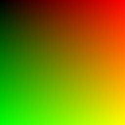
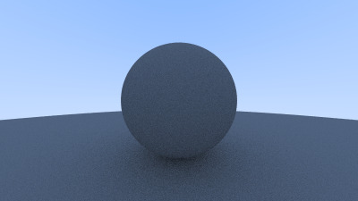
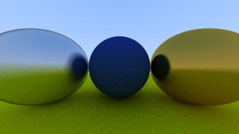
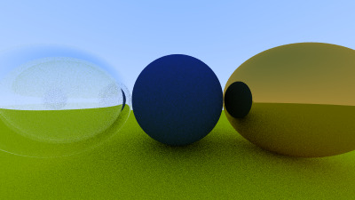
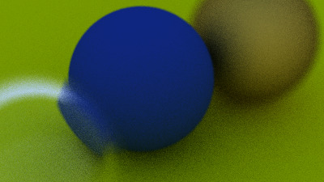
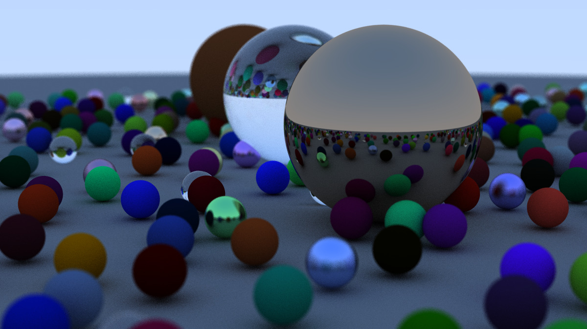

# Raydiance - A Simple Ray Tracer in C++

Raydiance is a ray tracer written in C++, built by following the [Ray Tracing in One Weekend](https://raytracing.github.io/) guide. It supports rendering spheres, reflections, refractions, depth of field, and multi-threaded rendering.

## Example Renders
Generated images are stored in the `images` directory. Here are some sample outputs:

<p align="center">
  
  <br>
  <em>Gradient Background</em>
</p>

<p align="center">
  
  <br>
  <em>Diffuse Sphere</em>
</p>


<p align="center">
  
  <br>
  <em>Metal Sphere</em>
</p>


<p align="center">
  
  <br>
  <em>Hollow Glass Sphere</em>
</p>

<p align="center">
  
  <br>
  <em>Depth of Field</em>
</p>

<p align="center">
  
  <br>
  <em>Final Render</em>
</p>


## Build Instructions

### Prerequisites
Ensure you have CMake and a C++17 compiler installed.

### Compilation & Execution
```sh
cmake -S . -B build
cmake --build build
build/Raydiance > images/15_FinalRender.ppm
```

